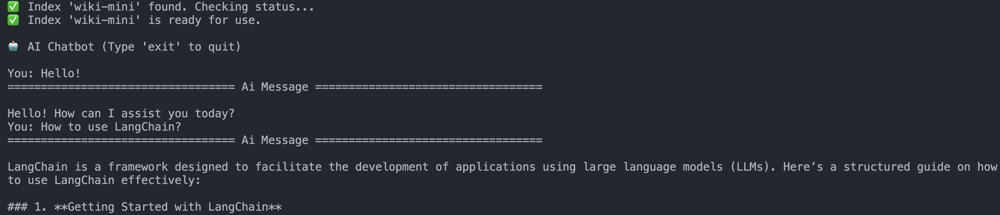
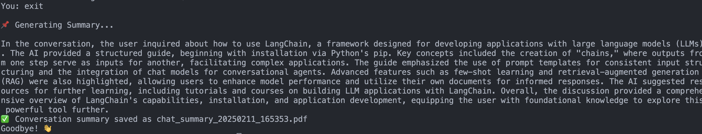
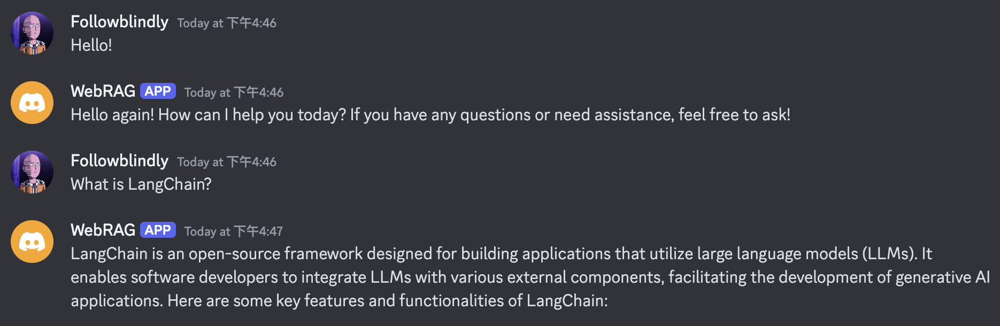
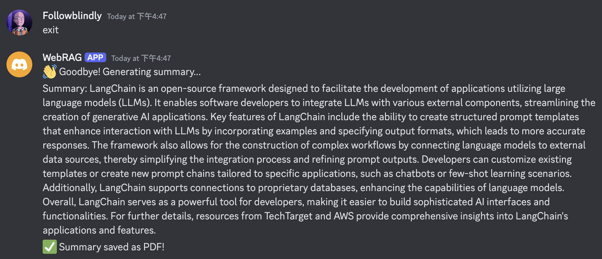

# **AgentRAG: AI-Powered Retrieval & Summarization with Web Search**

## **About**
This project is a comprehensive AI-driven system that integrates web crawling, scraping, vector search, and intelligent chatbot interactions. It extracts and processes online information, stores it in a Pinecone vector database, and enables fast and relevant retrieval using OpenAI embeddings. Key features include:

1. **Web Crawling** extracts and filters sitemap URLs to gather target pages.
2. **Vector Processing** chunks content, generates OpenAI embeddings, and stores them in Pinecone for semantic search.
3. **Hybrid Retrieval** combines vector similarity search and MMR optimization to fetch contextually relevant documents.
4. **AI Agents** leverage Retrieval-Augmented Generation (RAG) with Pinecone and LangGraph, enhanced by real-time web searches via Tavily API, to deliver accurate, context-aware responses.
5. **Multi-Interface Support** provides both REST APIs (FastAPI) and Discord chatbot integrations, featuring automatic conversation summarization and PDF export capabilities.

With these components, the system can power intelligent chatbots, research assistants, and automated knowledge retrieval applications. 🚀

## **Project Structure**

```bash
AgentRAG/
│── src/
│   ├── scraper.py     
│   ├── preprocess.py    
│   ├── retriever.py     
│   ├── discord_bot.py
│   ├── api.py                 
│── assets/              
│── requirements.txt    
│── README.md           
```

## **1. Web Crawling**

Extracts all links from a given `sitemap.xml` file and optionally filters them based on a provided substring.

### Run the script  
```bash
python src/crawl.py \
  --url "https://python.langchain.com/sitemap.xml" \
  --filter "/docs/tutorials/"
```

### Output Example
```
🔗 Found 12 Pages in Sitemap:
https://python.langchain.com/docs/tutorials/
https://python.langchain.com/docs/tutorials/agents/
https://python.langchain.com/docs/tutorials/chatbot/
...
```

## **2. Web Scraping & Vector Storage with Pinecone**

Fetche webpage content, processe it into text chunks, generate vector embeddings using OpenAI's embedding model, and store them in a Pinecone vector database for efficient retrieval.

### Run the script  
```bash
python src/preprocess.py \
  --urls "https://python.langchain.com/docs/tutorials/" \
  "https://python.langchain.com/docs/tutorials/agents/" \
  "https://python.langchain.com/docs/tutorials/chatbot/" \
  --index_name "langchain-tut"
```

### Output Example
```
Starting to fetch webpages...
Fetching pages: 100%|#############| 3/3 [00:00<00:00,  7.73it/s]
Text chunking...
Vectorizing and storing in Pinecone...
Index langchain-tut does not exist, creating...
✅ Index langchain-tut is ready
Successfully stored 19 chunks to index langchain-tut
```

## **3. Vector Search**

Retrieve relevant information from a Pinecone vector database using OpenAI embeddings.Initialize a Pinecone vector store, embed text using OpenAI's `text-embedding-ada-002` model, and allow searching via similarity or MMR-based retrieval. It retrieves and displays relevant results along with metadata.

### Run the script  
```bash
python src/retriever.py \
  --index "langchain-tut" \
  --search_type "similarity" \
  --query "What is a chatbot?"
```

### Output Example
```
✅ Index 'langchain-tut' found. Checking status...
✅ Index 'langchain-tut' is ready for use.

🔍 Search Results:
...
```

## **4. AI Agent with Retrieval & Web Search**

An AI agent that retrieves information from a vector database and supplements responses with web search results. It uses Pinecone for vector search, LangGraph for AI-driven interactions, and OpenAI's GPT model for response generation.

* Retrieval-Augmented Generation (RAG): Queries a Pinecone vector store for relevant context.
* Web Search Integration: Uses Tavily API to fetch external information when needed.
* Memory Management: Stores conversation history for summarization.
* PDF Export: Saves agent interactions as a PDF summary.

### Run the script  
```bash
python src/agent.py --mode chat
```

### Output Example
<!-- ```
🤖 AI Chatbot (Type 'exit' to quit)

You: What is LangChain?

================================== Ai Message ==================================

**LangChain Overview**
...

You: exit

📌 Generating Summary...
LangChain is an open-source framework...

✅ Conversation summary saved as chat_summary_20250211_141429.pdf
Goodbye! 👋
``` -->

  
  
  

## **5. Chat API with Retrieval and Summarization**

Provide a simple interface to interact with an AI model that can answer questions, retrieve relevant documents from a Pinecone vector store, and summarize conversation history. It combines local data retrieval with web search, making it adaptable for different use cases.

### Run the API

To run the FastAPI app, use the following command:
```bash
uvicorn main:app --host 0.0.0.0 --port 8000 --reload
```

## **6. Discord AI Chatbot**

A simple AI-powered chatbot for Discord, leveraging an agent-based execution model to process user queries and provide intelligent responses. The bot maintains conversation history and can generate summaries of interactions.

### Run the Bot

Ensure you have a valid Discord bot token and the necessary dependencies installed.
```bash
python src/discord_bot.py
```

### Run the Bot
* **Chat Bot**

  

* **Summarization**

  

## **Licence**

This repository is licensed under the Apache-2.0 License - see the [LICENSE](https://github.com/Followb1ind1y/AgentRAG/LICENSE) file for details.